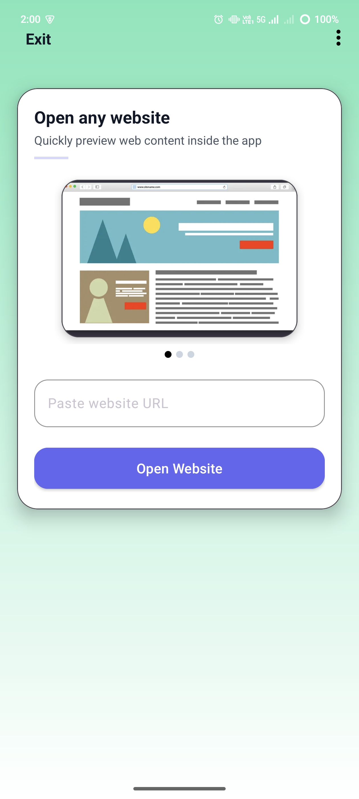
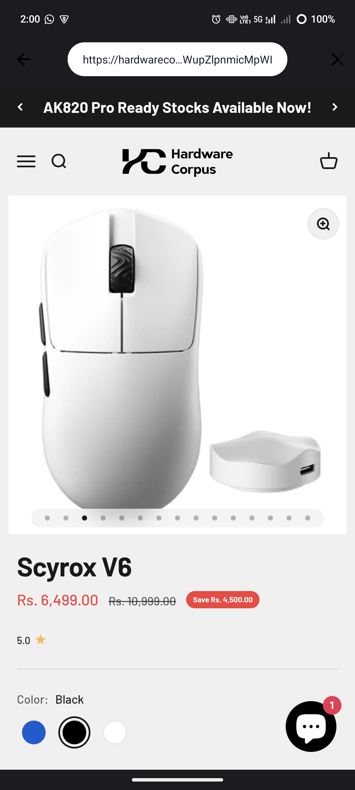
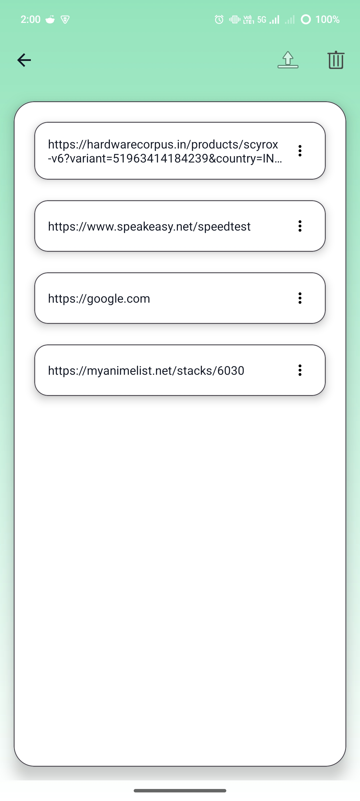

# WebToNative 🌐📱

A modern Android app that lets you open any website inside the app with a clean browser-like UI, history tracking, and upload support.

---

## 📸 Screenshots

### Home Screen


### Web View


### History Page


---

## ✨ Features

- Open any website inside the app
- Browser-style URL bar
- Website history tracking
- Upload history to server (Beeceptor)
- Clean Material UI
- Carousel onboarding
- Works with back navigation properly

---

## 🛠 Tech Stack

- Kotlin
- Android Jetpack
- Navigation Component
- ViewBinding
- WebView
- SharedPreferences
- Material Design 3

---

## 🚀 How to Run

1. Clone the repo
   ```bash
   git clone https://github.com/BON1TO/WebToNative.git
